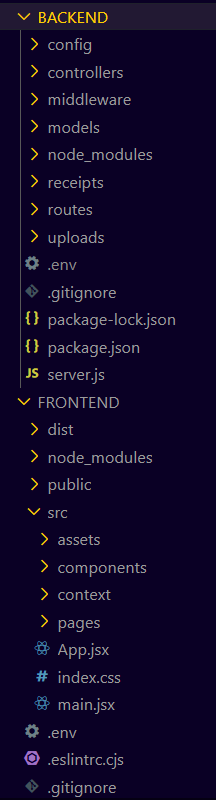

🛒 NFC Project – E-commerce Website for NFC Cards

This is a full-stack e-commerce website for selling customizable NFC (Near Field Communication) cards. It includes user authentication, cart functionality, admin features, Razorpay payment integration, and password reset via email.

🔗Live Site: [https://nfc-project-hdrf.vercel.app](https://nfc-project-hdrf.vercel.app)

---

🚀 Features

- Browse NFC card products
- Add items to cart
- Secure login & signup
- Reset password via email
- Place orders using Razorpay
- View order confirmation
- Generate downloadable PDF receipts
- Automatically email receipts to registered users for seamless transaction tracking

---

⚙️ Tech Stack

| Frontend        | Backend        | Database   | Tools & Services |
|----------------|----------------|------------|------------------|
| React.js        | Node.js + Express | MongoDB    | Vercel (frontend hosting) |
| Tailwind CSS    | JWT Auth       | Mongoose   | Render (backend hosting) |
| React Router DOM | Nodemailer     | Razorpay   | Git & GitHub |
| Context API     | Bcryptjs        |            | dotenv, axios|

---

📁 Project Structure

---

🖥️ Local Development

🔧 Prerequisites
- Node.js & npm
- MongoDB (local or cloud)
- Gmail (for nodemailer)
- Razorpay account

🔙 Backend Setup
- cd backend
- npm install
- npm start or nodemon server.js

🧑‍🎨 Frontend Setup
- cd frontend
- npm install
- npm run dev
